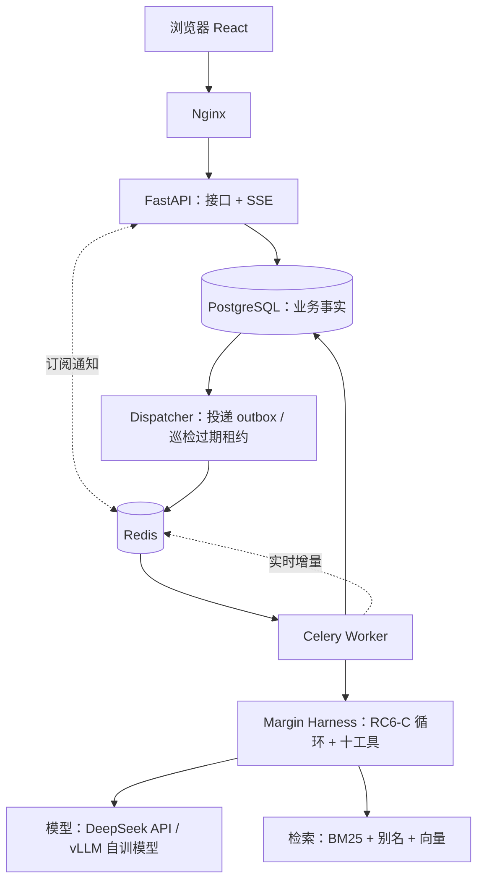

# Margin 后端计划

日期：2026-10-03。本文整合了此前三轮设计（`finetune/docs/development/20260917/01_AFAC后端技术栈与执行架构.md`、
ChatGPT 评审、`AFAC_Backend_Technical_Design.md` v2）以及 2026-10-03 的讨论结论。
**这是计划，不代表已经实现**；当前进度只看 [STATUS.md](../STATUS.md)。

---

## 1. 做什么

用户对固定的金融文档库（年报、债券募集说明书、保险条款等，573 个文档）提出跨文档、跨年度、
需要计算的问题。系统**异步**执行 Agent，**实时**展示它的思考和每一步工具调用，返回带原文出处的答案。

**要证明的能力**（对应校招 JD 里反复出现的要求）：

| JD 要求 | 本项目怎么体现 |
|---|---|
| 说明任务如何运行、失败后如何处理 | 任务状态机、Outbox、租约、取消、重试、故障测试 |
| Agent 观测与评测 | 每步思考/工具/耗时/token 可见；评测回放功能 |
| 多用户、限流、日志 | 登录、数据隔离、配额、模型并发控制、结构化日志 |
| FastAPI / PostgreSQL / Redis / 消息队列 | 主技术栈 |
| Harness 工程 | 自研 RC6-C Harness（笔记压缩、证据校验、错误恢复） |

**不做**：任意 PDF 上传与 OCR、多 Agent、联网搜索、微服务拆分、K8s、Kafka、答案缓存。

---

## 2. 技术栈：每个组件是什么、为什么用

| 组件 | 一句话解释 | 在本项目解决什么 | Java 生态对应 |
|---|---|---|---|
| **FastAPI** | Python 的 Web 接口框架 | 接收提问、查询任务、SSE 推送 | Spring Boot / Spring MVC |
| **Pydantic** | 数据校验 | 请求参数校验；工具参数校验 | Bean Validation + DTO |
| **PostgreSQL** | 关系数据库，系统的“账本” | 任务、步骤、事件、用户——唯一的事实来源 | MySQL |
| **SQLAlchemy 2.0** | ORM，用 Python 对象操作数据库 | 读写表、事务 | MyBatis / JPA |
| **Alembic** | 数据库表结构的版本管理 | 建表、改表都有迁移记录 | Flyway |
| **Redis** | 内存数据库 | ① Celery 的消息队列 ② 限流计数 ③ 实时通知 ④ 缓存 | Redis（同） |
| **Celery** | 后台任务框架 | 一道题要跑几分钟，不能在 HTTP 请求里跑完 | RocketMQ 消费者 / XXL-JOB |
| **SSE** | 服务器单向推送（HTTP 长连接） | 前端实时看到 Agent 在干什么 | SseEmitter |
| **Nginx** | 反向代理（大门） | 前端静态文件 + 转发 `/api` + SSE 关闭缓冲 | Nginx（同） |
| **Docker Compose** | 一条命令启动所有服务 | 本地开发与演示部署 | 同 |
| **pytest** | 测试框架 | 单元 / 接口 / 集成测试 | JUnit + Mockito |
| **React + TS + Vite** | 前端 | 提问、任务列表、运行详情（时间线 + 证据） | — |

**为什么 Python 不用 Java**：Agent 岗主流语言是 Python，Harness 本身是 Python；用 Java 写后端等于两套语言加
一层 RPC，没有新东西可讲。面试时把上表的 Java 对应讲清楚即可。

**为什么 FastAPI 不用 Django**：Django 是全家桶（自带 ORM、后台、模板），以同步为主；FastAPI 只管 API，
原生异步，SSE 流式推送自然，Pydantic 与模型的结构化输出契合。代价是登录权限要自己写——这正好是要学的。

**明确不用的**：

| 不用 | 原因（面试时这样答） |
|---|---|
| Kafka | 它是可回放的日志流，适合每秒几十万条事件；本项目是少量长任务，要的是单条确认、重试、取消 |
| RabbitMQ | 和 Redis 在这里干同一件事（Celery 的队列）。正确性由数据库租约保证，所以队列可替换；讲清原理即可 |
| LangGraph | WeSeeker 项目已用过。本项目要讲“为什么手写”：需精确控制每步状态快照，并与训练轨迹对齐 |
| 微服务 / K8s | 单机固定语料，用不上；能说清“什么时候会拆（例如把检索拆成独立服务）”比真拆更有说服力 |

---

## 3. 架构



一句话：**数据库记账，队列解耦，租约防并发写，SSE 看过程。**

一个问题的生命周期：

1. `POST /runs`：在**一个事务**里写入 run、第一个 attempt、一条 outbox 记录，立即返回 202 和 run_id。
2. Dispatcher 从 outbox 取出记录，往 Redis 队列发一条“请执行 attempt X”。
3. Worker 收到后先在数据库**领取租约**（条件更新），再跑 Harness；每完成一步，就把步骤和事件在一个事务里写库。
4. 浏览器通过 SSE 订阅这个 run 的事件：持久事件从数据库按序号补读，思考 token 从 Redis 实时转发。
5. 终态（成功/失败/取消）写库后，SSE 发送终态事件并关闭。

---

## 4. 数据模型（首版）

| 表 | 关键字段 | 说明 |
|---|---|---|
| users | id, username, password_hash | 密码用 argon2 哈希 |
| sessions | id, user_id, token_digest, expires_at, revoked_at | 只存 token 的哈希；登出即吊销 |
| runs | id, owner_id, question, options, answer_format, status, cancel_requested, idempotency_key, model, created_at | `unique(owner_id, idempotency_key)` 防重复提交 |
| attempts | id, run_id, attempt_no, status, lease_owner, lease_epoch, lease_until | 一次执行尝试；重试就新建一条，历史保留 |
| steps | attempt_id, step_no, tool_name, arguments, result, reasoning | `unique(attempt_id, step_no)` |
| events | run_id, seq, type, payload | `unique(run_id, seq)`，SSE 断线按 seq 补发 |
| outbox | id, attempt_id, status, next_attempt_at | 和业务写入同事务 |
| llm_calls | attempt_id, step_no, model, duration_ms, first_token_ms, tokens | 轻量的观测数据，开发者视图用 |

---

## 5. 关键机制（面试重点）

### 5.1 Outbox：解决“写库成功但消息丢了”
直接“写库 + 发消息”两步走，中间崩溃就会出现“任务记下了却没人执行”。Outbox 把“要发的消息”
也写进同一个事务；Dispatcher 再异步投递，失败就重试。代价：可能重复投递 → 由 5.2 的租约去重。

### 5.2 租约 + epoch（fencing token）：防止两个 worker 同时执行同一个任务
```sql
-- 领取：只有待执行或租约已过期的 attempt 才能被领取，每次领取 epoch + 1
UPDATE attempts SET status='running', lease_owner=:w, lease_epoch=lease_epoch+1,
       lease_until=now()+interval '90 seconds'
WHERE id=:id AND (status='pending' OR (status='running' AND lease_until < now()))
RETURNING lease_epoch;
-- 提交每一步：必须仍持有自己那个 epoch，否则说明自己是被接管的“旧 worker”
UPDATE attempts SET last_step=:n WHERE id=:id AND lease_epoch=:my_epoch;
```
Worker 有独立的心跳线程续租。Inspector 定期扫描过期租约，重新投递。

### 5.3 幂等提交
前端每次提交生成一个 `Idempotency-Key`；同一个 key 重复提交返回同一个 run，参数不同则返回 409。

### 5.4 两层事件：可靠和实时兼得
| 层 | 内容 | 存储 | 断线后 |
|---|---|---|---|
| 持久事件 | 步骤开始/结束、完整思考、工具结果、终态 | PostgreSQL，带 seq | 按 seq 补发 |
| 瞬时增量 | 思考和回答的逐字 token | Redis pub/sub，不落库 | 不补发，该步结束后由完整文本覆盖 |

每个 token 都写库会造成严重写放大，所以只有“结果”进库，“过程”走 Redis。

### 5.5 多用户
| 能力 | 做法 |
|---|---|
| 认证（你是谁） | 用户名密码登录 → 随机 session token 存 HttpOnly cookie，库里只存哈希 |
| 授权（你能看什么） | 所有查询都带 `owner_id`；访问别人的任务返回 404（不暴露是否存在） |
| 配额 | 每人同时最多 3 个运行中任务，每小时最多提交 20 个，超出返回 429 |
| 模型并发 | Redis + Lua 原子信号量，所有 worker 共享同一个模型并发上限，防止 429 风暴 |
| 状态隔离 | 每个任务独立的 Harness 状态，笔记和证据不会串 |

为什么用 Session 不用 JWT：浏览器的 EventSource（SSE）不能带自定义请求头，cookie 会自动带上；
Session 可以服务端随时吊销。

### 5.6 缓存（一个真实场景）
只缓存“证据原文查询”（cache-aside：先查 Redis，没有再查库并回填，带过期时间）。
**不缓存答案**：每次执行过程不同，缓存答案还会让人误以为结果被验证过。
借这个场景准备缓存穿透 / 击穿 / 雪崩的面试题。

---

## 6. 测试策略

| 类型 | 工具 | 例子 |
|---|---|---|
| 单元测试 | pytest | Harness 的压缩与停止条件、工具规则、计算、答案规范化 |
| 接口测试 | FastAPI TestClient | 幂等键重复提交只建一个 run；A 访问 B 的任务返回 404 |
| 集成测试 | pytest + Docker 里真实 PG / Redis | worker 崩溃后任务被接管；旧 worker 写入被拒；SSE 断线补发不丢不重 |
| Mock | FakeLLM | 不花钱、结果固定；可模拟“前 3 次返回 429” |
| CI | GitHub Actions | 每次 push 跑 ruff + pytest |

原则：一个测试对应一个会出事故的场景；全项目 40–60 个测试即可，不追求覆盖率。

---

## 7. 里程碑

每个里程碑结束时都能演示、能讲。“学习要点”是这一阶段顺带要弄懂的面试知识。

| 里程碑 | 内容 | 验收 | 学习要点 |
|---|---|---|---|
| **M0 Harness 移植** ✅ | RC6-C 轻量移植、检索、模型客户端、44 个测试 | 测试通过；真实语料能检索 | Agent 循环、上下文管理、BM25/RRF |
| **M0.5 真实运行** | 真实模型跑通几道题；LLM 客户端支持流式输出 | 3 类题各跑通一次 | OpenAI 接口、流式响应 |
| **M1 最小服务闭环** | FastAPI + PG + Alembic + Celery/Redis；Outbox；幂等；步骤持久化；按 seq 的简单 SSE；Compose | 提交 → 后台执行 → 刷新可见；重复提交只建一个 run | 事务、索引、唯一约束、消息队列、幂等 |
| **M2 过程可视化** | 两层事件；React 时间线（思考流式展开、工具卡片、引用批注） | 演示视频：思考逐字出现、刷新后历史完整 | SSE vs WebSocket、长连接、Nginx |
| **M3 多用户与治理** | 登录、owner 隔离、配额、LLM 信号量、分层重试、开发者视图、证据缓存 | A 看不到 B；10 个并发任务模型并发不超限 | Session/JWT、XSS/CSRF、限流算法、Lua、缓存三问题 |
| **M4 可靠性** | 租约 + epoch、心跳、Inspector、取消、显式重试、故障注入集成测试 | kill worker 后任务被接管；取消后不再调用模型 | 分布式锁、fencing token、至少一次 vs 恰好一次 |
| **M5 评测回放** | 固定题集作为批量任务跑同一条队列，产出准确率/步数/token 报告 | 一键回放 E80，报告可读 | 评测方法、批处理 |
| **M6 交付** | Nginx、CI、README、演示视频、Locust 压测报告 | 一条命令启动；绿色 CI | 压测指标、部署 |

**可选（时间够再做）**：B2 工具边界断点续跑（RC6-C 的笔记压缩让快照很小，比 RC6 好做）；
把十个工具包装成 MCP Server；文档增量入库（pgvector）。

**砍线顺序**（时间不够时）：评测回放 → 压测 → 开发者视图 → 证据缓存。M0–M2 + M4 前半是底线。

---

## 8. 风险与未决问题

| 问题 | 影响 | 处理 |
|---|---|---|
| DeepSeek API 是否接受历史消息里的 `reasoning_content`（RC6-C 思考回灌） | 不接受会返回 400 | M0.5 实测；不接受就在客户端发送前去掉该字段，只对自训模型保留 |
| 文档身份、表格上下文两类结果增强未移植 | 自训模型看到的结果比训练时少几个字段 | 先观察效果；需要时作为可选数据源补上（见 MIGRATION.md） |
| 检索与 RC6-C 原版不完全一致 | 和历史评测分数不可直接比较 | 评测回放时以 Margin 自己的结果为准 |
| 1.76 万 block 的 BM25 索引内存 | worker 并发上不去 | M1 实测单进程内存，再决定 worker 并发数 |

---

## 9. 简历条目（只写已验收的）

完成 M1–M4 后的参考写法（数字一律用实测值）：

> **Margin：可追溯证据的金融长文档 Agent 服务**（Python / FastAPI / PostgreSQL / Celery / Redis / React）
> - 自研 Agent Harness（十工具、写笔记即压缩上下文、原文引用校验、错误恢复），BM25 + 实体别名 + 向量三路 RRF 检索。
> - 基于 FastAPI、PostgreSQL、Celery/Redis 将 Harness 服务化：事务 Outbox 保证投递，租约 + epoch 防旧 worker 写回，
>   幂等键防重复提交；以【N】个故障注入测试验证 worker 崩溃后的任务接管。
> - 设计持久事件与瞬时增量两层事件模型，SSE 实时展示模型思考与工具调用，断线按序补发。
> - Session 认证与数据隔离，Redis Lua 分布式信号量统一管控模型并发，分层重试避免重试风暴。
