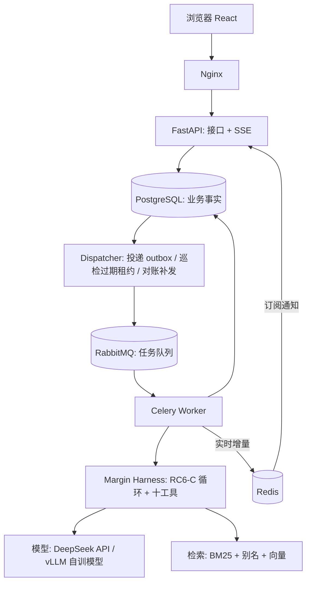

# Margin 后端计划

日期：2026-10-03。本文整合了此前三轮设计（`finetune/docs/development/20260917/01_AFAC后端技术栈与执行架构.md`、
ChatGPT 评审、`AFAC_Backend_Technical_Design.md` v2）以及 2026-10-03 的讨论结论。
**这是计划，不代表已经实现**；当前进度只看 [STATUS.md](../STATUS.md)。

---

## 1. 做什么

用户对固定的金融文档库（年报、债券募集说明书、保险条款等，573 个文档）提出跨文档、跨年度、
需要计算的问题。系统**异步**执行 Agent，**实时**展示它的思考和每一步工具调用，返回带原文出处的答案。

**要证明的能力**（对应校招 JD 里反复出现的要求）：

| JD 要求 | 本项目怎么体现 |
|---|---|
| 说明任务如何运行、失败后如何处理 | 任务状态机、Outbox、租约、取消、重试、故障测试 |
| Agent 观测与评测 | 每步思考/工具/耗时/token 可见；评测回放功能 |
| 多用户、限流、日志 | 登录、数据隔离、配额、模型并发控制、结构化日志 |
| FastAPI / PostgreSQL / Redis / 消息队列 | 主技术栈 |
| Harness 工程 | 自研 RC6-C Harness（笔记压缩、证据校验、错误恢复） |

**不做**：任意 PDF 上传与 OCR、多 Agent、联网搜索、微服务拆分、K8s、Kafka、答案缓存。

---

## 2. 技术栈：每个组件是什么、为什么用

| 组件 | 一句话解释 | 在本项目解决什么 | Java 生态对应 |
|---|---|---|---|
| **FastAPI** | Python 的 Web 接口框架 | 接收提问、查询任务、SSE 推送 | Spring Boot / Spring MVC |
| **Pydantic** | 数据校验 | 请求参数校验；工具参数校验 | Bean Validation + DTO |
| **PostgreSQL** | 关系数据库，系统的“账本” | 任务、步骤、事件、用户——唯一的事实来源 | MySQL |
| **SQLAlchemy 2.0** | ORM，用 Python 对象操作数据库 | 读写表、事务 | MyBatis / JPA |
| **Alembic** | 数据库表结构的版本管理 | 建表、改表都有迁移记录 | Flyway |
| **RabbitMQ** | 专门的消息队列（消息中转站） | Celery 的任务队列：原生消息确认、持久化、发送确认（D19，替代 M1 的 Redis 队列） | RabbitMQ（同） |
| **Redis** | 内存数据库 | ① 实时通知 ② 限流计数 ③ 缓存 | Redis（同） |
| **Celery** | 后台任务框架 | 一道题要跑几分钟，不能在 HTTP 请求里跑完 | RocketMQ 消费者 / XXL-JOB |
| **SSE** | 服务器单向推送（HTTP 长连接） | 前端实时看到 Agent 在干什么 | SseEmitter |
| **Nginx** | 反向代理（大门） | 前端静态文件 + 转发 `/api` + SSE 关闭缓冲 | Nginx（同） |
| **Docker Compose** | 一条命令启动所有服务 | 本地开发与演示部署 | 同 |
| **pytest** | 测试框架 | 单元 / 接口 / 集成测试 | JUnit + Mockito |
| **React + TS + Vite** | 前端 | 提问、任务列表、运行详情（时间线 + 证据） | — |

**为什么 Python 不用 Java**：Agent 岗主流语言是 Python，Harness 本身是 Python；用 Java 写后端等于两套语言加
一层 RPC，没有新东西可讲。面试时把上表的 Java 对应讲清楚即可。

**为什么 FastAPI 不用 Django**：Django 是全家桶（自带 ORM、后台、模板），以同步为主；FastAPI 只管 API，
原生异步，SSE 流式推送自然，Pydantic 与模型的结构化输出契合。代价是登录权限要自己写——这正好是要学的。

**明确不用的**：

| 不用 | 原因（面试时这样答） |
|---|---|
| Kafka | 它是可回放的日志流，适合每秒几十万条事件；本项目是少量长任务，要的是单条确认、重试、取消 |
| LangGraph | WeSeeker 项目已用过。本项目要讲“为什么手写”：需精确控制每步状态快照，并与训练轨迹对齐 |
| 微服务 / K8s | 单机固定语料，用不上；能说清“什么时候会拆（例如把检索拆成独立服务）”比真拆更有说服力 |

---

## 3. 架构



一句话：**数据库记账，队列解耦，租约防并发写，SSE 看过程。**

一个问题的生命周期：

1. `POST /runs`：在**一个事务**里写入 run、第一个 attempt、一条 outbox 记录，立即返回 202 和 run_id。
2. Dispatcher 从 outbox 取出记录，往 RabbitMQ 队列发一条“请执行 attempt X”（收到发送确认才标记 sent；
   消息丢了由巡检对账补发，见 5.7）。
3. Worker 收到后先在数据库**领取租约**（条件更新），再跑 Harness；每完成一步，就把步骤、事件、断点在一个带 epoch 检查的事务里写库，
   提交后再往 Redis 发“有新事件”的通知。
4. 浏览器通过 SSE 订阅这个 run 的事件：持久事件从数据库按序号补读，思考 token 从 Redis 实时转发。
5. 终态（成功/失败/取消）写库后，SSE 发送终态事件并关闭。

---

## 4. 数据模型（首版）

| 表 | 关键字段 | 说明 |
|---|---|---|
| users | id, username, password_hash | 密码用 argon2 哈希 |
| sessions | id, user_id, token_digest, expires_at, revoked_at | 只存 token 的哈希；登出即吊销 |
| runs | id, owner_id, question, options, answer_format, status, cancel_requested, idempotency_key, model, created_at | `unique(owner_id, idempotency_key)` 防重复提交 |
| attempts | id, run_id, attempt_no, status, model, trigger, lease_owner, lease_epoch, lease_until, last_step, final, violation, error, started_at, finished_at（M4 加 checkpoint） | 一次执行尝试；重试（自动 / 用户“重新生成”）就新建一条，历史保留；接管不新建，epoch+1；checkpoint（JSONB）是断点 |
| steps | attempt_id, step_no, tool_name, arguments, result, reasoning, llm_ms, prompt_tokens, completion_tokens | `unique(attempt_id, step_no)` |
| events | run_id, seq, type, payload | `unique(run_id, seq)`，SSE 断线按 seq 补发 |
| outbox | id, attempt_id, status, next_attempt_at | 和业务写入同事务；部分唯一索引：同一 attempt 最多一条 pending |
| llm_calls（M3） | attempt_id, step_no, model, duration_ms, first_token_ms, tokens | 轻量的观测数据，开发者视图用；M1 的耗时和 token 先记在 steps 上 |

---

## 5. 关键机制（面试重点）

### 5.1 Outbox：解决“写库成功但消息丢了”
直接“写库 + 发消息”两步走，中间崩溃就会出现“任务记下了却没人执行”。Outbox 把“要发的消息”
也写进同一个事务；Dispatcher 再异步投递，失败就重试。代价：可能重复投递 → 由 5.2 的租约去重。

### 5.2 租约 + epoch（fencing token）、接管与超时监督（2026-10-05 修订，D17）

完整推导和问答见 `review/03_架构对齐与租约方案.md`。M1 已实现：领取（只接受 pending）、带 epoch 的提交、续租线程、巡检（过期判失败并 epoch+1）、客户端超时、Celery 配置；接管、断点、监督者在 M4（D18）。要点：

- **领取 = 一条条件 UPDATE**（判断与修改在同一语句里，不“先查再写”）；“过期”只是 `lease_until < now()` 的比较，
  时间一律用数据库的 `now()`：
  ```sql
  UPDATE attempts SET status='running', lease_owner=:w, lease_epoch=lease_epoch+1,
         lease_until=now()+interval '90 seconds'
  WHERE id=:id AND (status='pending' OR (status='running' AND lease_until < now()))
  RETURNING lease_epoch;
  ```
- **每一步提交带 epoch**：同一事务里 `UPDATE attempts … WHERE lease_epoch=:my_epoch`（同时写断点、续租）
  + 写 steps + 写 events；更新 0 行说明已被取代 → 回滚并停止。
- **接管 vs 重试**：接管 = worker 出事，同一 attempt epoch+1，从最后一个已提交步骤之后继续（读断点），最多 3 次；
  重试 = 新建 attempt 从头开始，自动（执行失败，换备用模型，1 次）或手动（用户点“重新生成”，计入配额）。
- **Inspector**（在 dispatcher 进程里）每 15 秒：给租约过期的 running attempt、消息丢失的 pending attempt 补一条 outbox；
  outbox 部分唯一索引保证同一 attempt 最多一条 pending。
- **超时预算**：LLM 总 180s / 首块 60s / 块间 30s；检索 30s；单个工具 60s；整个 attempt 20 分钟。
- **监督者**（心跳线程）：每 5 秒检查超时与 epoch，每 15 秒续租；发现问题举起停止标志；
  60 秒无回应判定卡死 → `os._exit` 结束子进程，Celery 补新进程，任务由别人接管；Celery 硬时限 25 分钟只防整个进程冻住。
- **被取代的 worker**：续租 / 提交 / 主线程检查点任一处发现 epoch 不对就停止，不写任何东西；关闭 HTTP 流、回滚、
  释放模型并发名额（名额自带过期时间）。实时片段带 epoch，前端丢弃旧 epoch。
- **Celery 配置**：`acks_late=True` + `prefetch_multiplier=1`（每个槽位只拿正在跑的那一条），确认期限 `consumer_timeout` 1 小时（M1.5 起用 RabbitMQ，见 5.7；M1 用 Redis 时是 `visibility_timeout` 2 小时）；
  M1 一个 worker 容器 4 个子进程，扩容加容器。队列只是唤醒信号，谁执行由数据库决定。

### 5.3 幂等提交
前端每次提交生成一个 `Idempotency-Key`；同一个 key 重复提交返回同一个 run，参数不同则返回 409。

### 5.4 两层事件：可靠和实时兼得
| 层 | 内容 | 存储 | 断线后 |
|---|---|---|---|
| 持久事件 | 步骤开始/结束、完整思考、工具结果、终态 | PostgreSQL，带 seq | 按 seq 补发 |
| 瞬时增量 | 思考和回答的逐字 token | Redis pub/sub，不落库 | 不补发，该步结束后由完整文本覆盖 |

每个 token 都写库会造成严重写放大，所以只有“结果”进库，“过程”走 Redis。

**持久事件的“有新事件”通知：用 PG LISTEN / NOTIFY（D20，2026-10-06 定）**。现在每个 SSE 连接每秒查一次 events 表，
用户越多查询越多。改为：`add_event` 在同一事务里 `NOTIFY run_events, '<run_id>'`；
**每个 API 进程只开一条 LISTEN 连接**（不能每个 SSE 连接各开一条，会耗尽 PG 连接），收到后在内存里转给关注这个
run 的 SSE 连接，再由它们按 seq 查库。通知来自事务提交，不会出现“通知到了、事件还没提交”。
SSE 仍保留低频兜底查询（例如每 10 秒），防止错过通知（通知不持久，LISTEN 连接重连期间会丢）。
逐字片段仍走 Redis pub/sub：不落库、量大，NOTIFY 单条有 8KB 上限且会经过 PG。

**心跳与半死连接（M2 实现时补充，D22）**：SSE 空闲 10 秒发一个具名事件 `event: ping`（不带 id，不影响 Last-Event-ID）；
前端 25 秒什么都没收到就关掉连接、用 `?after=<最后的 seq>` 重建。原因：中间的代理不一定把断开传给浏览器
（M2 联调时 Vite 代理在 API 进程死掉后一直挂着浏览器侧连接），只靠 EventSource 的自动重连会永远等下去。

### 5.5 多用户
| 能力 | 做法 |
|---|---|
| 认证（你是谁） | 用户名密码登录 → 随机 session token 存 HttpOnly cookie，库里只存哈希 |
| 授权（你能看什么） | 所有查询都带 `owner_id`；访问别人的任务返回 404（不暴露是否存在） |
| 配额 | 每人同时最多 3 个运行中任务，每小时最多提交 20 个，超出返回 429 |
| 模型并发 | Redis + Lua 原子信号量，所有 worker 共享同一个模型并发上限，防止 429 风暴 |
| 状态隔离 | 每个任务独立的 Harness 状态，笔记和证据不会串 |

为什么用 Session 不用 JWT：浏览器的 EventSource（SSE）不能带自定义请求头，cookie 会自动带上；
Session 可以服务端随时吊销。

### 5.6 缓存（一个真实场景）
只缓存“证据原文查询”（cache-aside：先查 Redis，没有再查库并回填，带过期时间）。
**不缓存答案**：每次执行过程不同，缓存答案还会让人误以为结果被验证过。
借这个场景准备缓存穿透 / 击穿 / 雪崩的面试题。

### 5.7 队列切换到 RabbitMQ + 消息丢失对账（2026-10-06，D19）

**问题（M1 review 发现）**：dispatcher 把消息发出去、outbox 标成 sent 之后，如果消息在消息中转站里丢了
（Redis 重启、队列被清空），attempt 会永远停在 pending：没有 worker 收到消息，M1 的巡检只处理 running；
用户点“重新生成”也会因为“还有 pending 的执行”返回 409。这道题就永远卡住了。

**思路：两层。** 可靠的队列让消息尽量不丢；数据库对账保证丢了能补回来。PG 仍然是唯一的裁判，
补发出来的重复消息由 `claim` 挡住，所以补发猜错的代价只是一条多余的消息。

#### 第一层：RabbitMQ 配置（尽量不丢）

| 配置 | 值 | 为什么 |
|---|---|---|
| 发送确认 | Celery `broker_transport_options={"confirm_publish": True}` | RabbitMQ 回复“收到了”，dispatcher 才标记 sent；没收到确认就按现有的退避规则重发 |
| 队列 / 消息持久化 | 队列 durable、消息 persistent（Celery 用 RabbitMQ 时的默认值，保持不改） | RabbitMQ 重启后消息还在 |
| 数据卷 + 固定主机名 | `rabbitmqdata:/var/lib/rabbitmq`，`hostname: rabbitmq` | RabbitMQ 的数据目录按节点名（取自主机名）区分，主机名变了会“找不到”旧数据 |
| 确认期限 `consumer_timeout` | 1 小时（配置文件挂进 `/etc/rabbitmq/conf.d/`） | 超时会关闭整个通道、所有待确认消息回队列；必须大于 Celery 硬时限 25 分钟，保证永远不触发。超时分层：模型 180 秒 < 硬时限 25 分钟 < 确认期限 1 小时 |
| 确认时机与预取 | 保留 `task_acks_late=True`、`worker_prefetch_multiplier=1` | 执行完才确认；每个子进程手上只有正在执行的一条 |
| Redis 专用配置 | 删除 `visibility_timeout` | RabbitMQ 有原生确认，不需要模拟 |

#### 第二层：巡检对账 `requeue_lost`（dispatcher 每 15 秒，和 `expire_leases` 同一轮）

**候选**：attempt 是 pending、outbox 是 sent、投递已经超过**宽限期 2 分钟**。
宽限期吸收两件事：几个子进程同时取消息时领取顺序的毫秒级抖动；子进程处理第一个任务前要加载语料和 BM25
（有缓存约 2 秒，缓存丢失时要重建，更久，这种情况误判只会多一条消息）。

**判定**：候选满足下面任意一条，就认为消息丢了：

| 规则 | 条件 | 适用场景 |
|---|---|---|
| ① 水位线 | 存在**比我晚投递**、且已经被领取（attempt 不是 pending）的任务 | 有流量时的主规则。队列先进先出，后面的都被领走了，我还在等，说明我的消息丢了；流量越大发现越快 |
| ② 队列为空 | RabbitMQ 里就绪消息数 = 0 | 没有流量时水位线不动，靠这一条 |
| ③ 兜底 | 投递已经超过 30 分钟 | 前两条都判断不了时（例如查不到队列状态） |

“就绪消息数”和“消费者数”用被动声明队列取得（`queue_declare(passive=True)`，只读，不改队列）。
它只统计就绪消息，不含待确认的；正在执行的任务处于待确认状态，对应的 attempt 已经是 running，
所以“队列为空 + 仍是 pending”只可能是丢了。查不到队列状态（RabbitMQ 连不上）时跳过规则 ②。
**消费者数为 0 时不补发**：没有 worker 在线，补发也没人收，这是“worker 全挂了”，交给告警处理。

**动作**：

```sql
-- 补发：复用同一行 outbox，改回 pending，下一秒 dispatch_once 就会投递
UPDATE outbox SET status='pending', next_attempt_at=now(), redeliveries=redeliveries+1
WHERE id=:id AND status='sent';
```

- 复用同一行：outbox 上“同一个 attempt 最多一条 pending”的部分唯一索引仍然成立；重新投递时 `sent_at` 会更新，
  这条消息重新排到队尾，水位线按新时间计算。
- **补发上限 3 次**：第 4 次判定丢失时不再补发，改为把 attempt 判失败
  （`UPDATE attempts SET status='failed', error='delivery_lost', lease_epoch=lease_epoch+1 WHERE id=:id AND status='pending'`，
  同一事务里 run 判失败、写 `attempt_failed` 事件）。用户可以点“重新生成”，同时触发告警。
- 并发安全：所有更新都带状态条件。巡检判定的同时如果 worker 刚好领取了，attempt 已经是 running，
  判失败那条更新 0 行；补发出去的那条消息到了 worker 手里，也会被 `claim` 挡住。
- 每次补发记一条 warning 日志，并计数（M6 接到监控，“补发次数 > 0”就告警：说明消息中转站出了问题）。

**查询**（水位线只看最近 1 小时，避免扫全表）：

```sql
-- 候选：数量很少
SELECT o.id, o.attempt_id, o.sent_at, o.redeliveries
FROM outbox o JOIN attempts a ON a.id = o.attempt_id
WHERE o.status = 'sent' AND a.status = 'pending' AND o.sent_at < now() - interval '2 minutes';

-- 水位线：已被领取的任务里最晚的投递时间
SELECT max(o.sent_at)
FROM outbox o JOIN attempts a ON a.id = o.attempt_id
WHERE o.status = 'sent' AND a.started_at IS NOT NULL AND o.sent_at > now() - interval '1 hour';
-- （实现时把原来的 a.status <> 'pending' 改成 started_at：判为 delivery_lost 的不算“已被领取”，D21）
-- 候选 sent_at < 水位线  →  规则 ① 成立
```

**表结构（迁移 0002）**：outbox 加 `redeliveries int not null default 0`（补发次数；不复用 `tries`，
`tries` 是投递失败次数，用来算退避时间）；加部分索引 `outbox(sent_at) WHERE status='sent'`，供水位线查询使用。

**前提与限制**：水位线依赖“同一个队列 + 先进先出”。以后加优先级队列或拆成多个队列，要按队列分别计算水位线。

#### 测试（集成测试，真实 PG；队列状态作为参数传入，不依赖 RabbitMQ）

1. 比我晚投递的任务已被领取、我仍 pending 且超过宽限期 → outbox 回到 pending，补发次数为 1
2. 宽限期内（1 分钟前投递），即使水位线已越过也不补发（领取顺序抖动）
3. 队列为空、pending 超过宽限期 → 补发
4. 队列不空、水位线未越过、不到 30 分钟 → 不补发（正常排队）
5. 已补发 3 次仍判定丢失 → attempt 判为 `delivery_lost` 失败、epoch + 1，之后可以重新生成
6. 消费者数为 0 → 不补发
7. （改造现有测试）RabbitMQ 连不上、或拒收（没有确认）时，outbox 保持 pending 并退避

#### 切换步骤（M1.5）

1. compose：新增 `rabbitmq` 服务（`rabbitmq:4-management-alpine`，5672 + 管理界面 15672 只绑 127.0.0.1，
   数据卷、固定主机名、健康检查 `rabbitmq-diagnostics -q ping`、`consumer_timeout` 配置文件）；
   worker、dispatcher 依赖它健康后再启动。
2. 配置：新增 `MARGIN_BROKER_URL`（`amqp://...`），写进 `.env.example`；compose 里覆盖成容器内地址。
3. `worker.py`：broker 改用新配置；删掉 `visibility_timeout`。发送确认实际开在 dispatcher 自己的 publisher 上（D21）。
4. `dispatcher.py`：投递失败的异常范围加上“拒收 / 未确认”；新增 `requeue_lost` 和读取队列状态的函数，巡检时调用。
5. 迁移 0002 + `models.py`。
6. 依赖：`celery[redis]` 改为 `celery`（RabbitMQ 客户端是 Celery 的默认依赖）；Redis 客户端到 M2 做推流时再加。
7. 文档：D19、本节、README 和 `review/01_运行链路.md` 里的队列描述。
8. dispatcher 改为 LISTEN / NOTIFY 唤醒，见下一小节。

#### dispatcher 用 LISTEN / NOTIFY 唤醒（代替每秒轮询）

现在 `main()` 每轮 `time.sleep(1)` 后扫一次 outbox：空闲时每秒白查一次，有新任务时最多晚 1 秒才投递。

- **发通知**：在写 outbox 的事务里执行 `NOTIFY outbox`。共两处：`runs._enqueue_attempt`（新任务），
  和 `requeue_lost`（对账时把 outbox 改回 pending）。NOTIFY 是跟着事务走的：提交后才真正发出，回滚则取消，
  所以 dispatcher 被叫醒时那一行一定已经能查到。同一事务里的多次相同通知会合并成一条。
- **收通知**：dispatcher 另开一条**专用的自动提交连接**执行 `LISTEN outbox`（LISTEN 要求连接不在未提交的事务里，
  所以不从连接池里借）；`time.sleep(1)` 改成用 psycopg 3 的 `notifies(timeout=...)` 等通知。
- **定时扫描保留作兜底**：等待的上限 = min(距离最早一条退避记录到期还有多久, 10 秒)。
  通知只负责“有新任务”，退避到期的重试、dispatcher 重启期间错过的通知（通知不持久，没人在听就丢了）都靠兜底扫描。
- 15 秒一次的巡检（`expire_leases`、`requeue_lost`）不变。
- 专用连接断开（PG 重启）时直接退出进程，由 compose 的 restart 策略拉起，和现在“数据库出错就退出”的策略一致。
- **测试**：提交一个任务后，dispatcher 在 1 秒内（不靠兜底扫描）就把它投递出去；
  事务回滚时不会收到通知、也不会投递。

---

## 6. 测试策略

| 类型 | 工具 | 例子 |
|---|---|---|
| 单元测试 | pytest | Harness 的压缩与停止条件、工具规则、计算、答案规范化 |
| 接口测试 | FastAPI TestClient | 幂等键重复提交只建一个 run；A 访问 B 的任务返回 404 |
| 集成测试 | pytest + Docker 里真实 PG / Redis | worker 崩溃后任务被接管；旧 worker 写入被拒；SSE 断线补发不丢不重 |
| Mock | FakeLLM | 不花钱、结果固定；可模拟“前 3 次返回 429” |
| CI | GitHub Actions | 每次 push 跑 ruff + pytest |

原则：一个测试对应一个会出事故的场景；全项目 40–60 个测试即可，不追求覆盖率。

---

## 7. 里程碑

每个里程碑结束时都能演示、能讲。“学习要点”是这一阶段顺带要弄懂的面试知识。

| 里程碑 | 内容 | 验收 | 学习要点 |
|---|---|---|---|
| **M0 Harness 移植** ✅ | RC6-C 轻量移植、检索、模型客户端、44 个测试 | 测试通过；真实语料能检索 | Agent 循环、上下文管理、BM25/RRF |
| **M0.5 真实运行** | 真实模型跑通几道题；LLM 客户端支持流式输出 | 3 类题各跑通一次 | OpenAI 接口、流式响应 |
| **M1 最小服务闭环** ✅ | FastAPI + PG + Alembic + Celery/Redis；Outbox；幂等；步骤持久化（带 epoch 的提交）；最小巡检；重新生成；客户端超时；按 seq 的简单 SSE；Compose | 提交 → 后台执行 → 刷新可见；重复提交只建一个 run | 事务、索引、唯一约束、消息队列、幂等 |
| **M1.5 队列切换与对账** ✅ | 消息队列换成 RabbitMQ；巡检对账补发丢失的消息（水位线 + 队列为空 + 兜底，补发上限后判失败）；迁移 0002；dispatcher 改为 LISTEN / NOTIFY 唤醒（见 5.7） | 清空队列后 pending 任务被补发并完成；对账 6 个场景的集成测试通过 | 消息确认、发送确认、通道、超时分层、对账 |
| **M2 过程可视化** ✅ | 两层事件（实时片段带 epoch）；React 时间线（思考流式展开、工具卡片、引用批注） | 演示视频：思考逐字出现、刷新后历史完整 | SSE vs WebSocket、长连接、Nginx |
| **M3 多用户与治理** | 登录、owner 隔离、配额、LLM 信号量、分层重试、开发者视图、证据缓存 | A 看不到 B；10 个并发任务模型并发不超限 | Session/JWT、XSS/CSRF、限流算法、Lua、缓存三问题 |
| **M4 可靠性** | 接管（从断点继续）、监督者心跳（超时预算 + 卡死判定）、Inspector、取消、自动重试、故障注入集成测试（7 个场景，见 review/03） | kill worker 后任务被接管；取消后不再调用模型 | 分布式锁、fencing token、至少一次 vs 恰好一次 |
| **M5 评测回放** | 固定题集作为批量任务跑同一条队列，产出准确率/步数/token 报告 | 一键回放 E80，报告可读 | 评测方法、批处理 |
| **M6 交付** | Nginx、CI、README、演示视频、Locust 压测报告；监控告警（`/metrics` + Prometheus + Grafana，规则见 review/m1_review.md 第四章第 10 节） | 一条命令启动；绿色 CI；面板能看到队列积压、补发次数、租约过期数，并能触发告警 | 压测指标、部署、可观测性（指标 / 日志 / 链路追踪）、告警设计 |

**可选（时间够再做）**：B2 工具边界断点续跑（RC6-C 的笔记压缩让快照很小，比 RC6 好做）；
把十个工具包装成 MCP Server；文档增量入库（pgvector）。

**砍线顺序**（时间不够时）：评测回放 → 压测 → 开发者视图 → 证据缓存。M0–M2 + M4 前半是底线。

---

## 8. 风险与未决问题

| 问题 | 影响 | 处理 |
|---|---|---|
| DeepSeek API 是否接受历史消息里的 `reasoning_content`（RC6-C 思考回灌） | 不接受会返回 400 | M0.5 实测；不接受就在客户端发送前去掉该字段，只对自训模型保留 |
| 文档身份、表格上下文两类结果增强未移植 | 自训模型看到的结果比训练时少几个字段 | 先观察效果；需要时作为可选数据源补上（见 MIGRATION.md） |
| 检索与 RC6-C 原版不完全一致 | 和历史评测分数不可直接比较 | 评测回放时以 Margin 自己的结果为准 |
| 1.76 万 block 的 BM25 索引内存 | worker 并发上不去 | M1 实测：每个子进程约 1.1GB，并发 4 约 4.5GB（D18），暂不需要优化 |

---

## 9. 简历条目（只写已验收的）

完成 M1–M4 后的参考写法（数字一律用实测值）：

> **Margin：可追溯证据的金融长文档 Agent 服务**（Python / FastAPI / PostgreSQL / Celery / Redis / React）
> - 自研 Agent Harness（十工具、写笔记即压缩上下文、原文引用校验、错误恢复），BM25 + 实体别名 + 向量三路 RRF 检索。
> - 基于 FastAPI、PostgreSQL、Celery/Redis 将 Harness 服务化：事务 Outbox 保证投递，租约 + epoch 防旧 worker 写回，
>   幂等键防重复提交；以【N】个故障注入测试验证 worker 崩溃后的任务接管。
> - 设计持久事件与瞬时增量两层事件模型，SSE 实时展示模型思考与工具调用，断线按序补发。
> - Session 认证与数据隔离，Redis Lua 分布式信号量统一管控模型并发，分层重试避免重试风暴。
